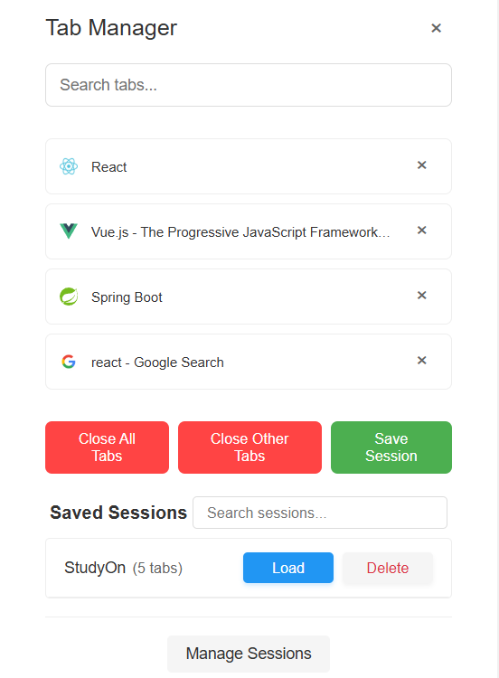
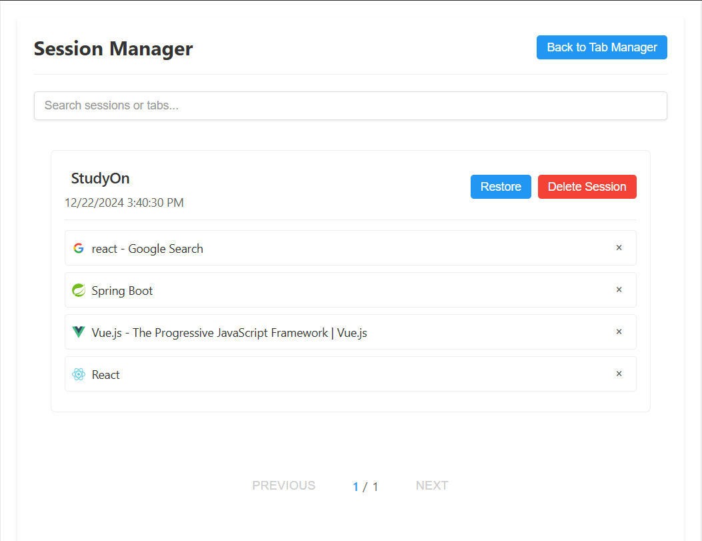

# Tab Manager Extension

A powerful browser extension for efficient tab management, helping you organize and manage your browser tabs with ease.

## Features

### 🔍 Quick Tab Search
- Instantly search through all your open tabs
- Real-time filtering as you type
- Search by title or URL

### 💾 Session Management
- Save your current tab setup as a session
- Restore previously saved sessions with one click
- Organize multiple sessions for different tasks or projects
- Search through saved sessions

### 🗑️ Batch Operations
- Close all tabs at once
- Close other tabs (keep current tab)

### 🎯 Other Features
- Clean and intuitive user interface
- Lightweight and fast performance
- Cross-browser compatibility

## Installation

### Chrome Installation
1. Download this repository as ZIP or clone it
2. Open Chrome and navigate to `chrome://extensions/`
3. Enable "Developer mode" in the top right corner
4. Click "Load unpacked" and select the extension directory
5. The Tab Manager icon should appear in your browser toolbar

### Edge Installation
1. Download this repository as ZIP or clone it
2. Open Edge and navigate to `edge://extensions/`
3. Enable "Developer mode" in the bottom left
4. Click "Load unpacked" and select the extension directory
5. The Tab Manager icon should appear in your browser toolbar

## How to Use

### Basic Usage
1. Click the Tab Manager icon in your browser toolbar
2. Use the search box to filter through your open tabs
3. Click on a tab in the list to switch to it
4. Click the "×" button next to a tab to close it

### Session Management
1. Click "Save Session" to save your current tabs
2. Open the Manage Sessions to view all saved sessions
3. Use the search box to find specific sessions
4. Click on a session to restore its tabs
5. Use the delete button to remove unwanted sessions

## Contributing

Contributions are welcome! Please feel free to submit a Pull Request.

## License

This project is licensed under the MIT License - see the [LICENSE](LICENSE) file for details.

## Support

If you encounter any issues or have suggestions for improvements, please open an issue on GitHub.

---
Made with ❤️ for better tab management
